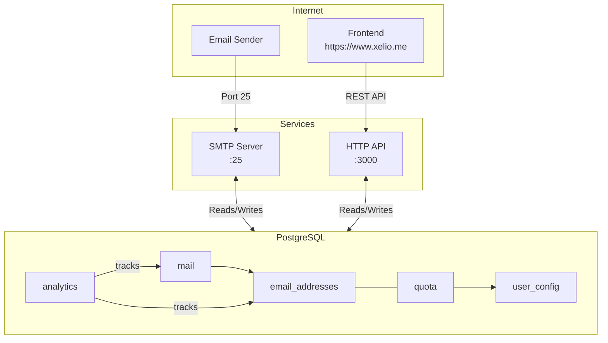

# TempMail

Temporary email service with SMTP receiving and HTTP API.

## Architecture



## Features

- SMTP server for receiving emails
- REST API for email management
- UUID-based identifiers
- Rate limiting (100 req/sec, burst 150)
- Analytics tracking
- Automatic cleanup after 1 day

## Quick Start

```bash
# Build
cargo build --release

# Run services
cargo run --package http    # API on :3000
cargo run --package smtp    # SMTP on :25
```

## API Endpoints

| Method | Endpoint | Description |
|--------|----------|-------------|
| GET | `/` | Health check |
| POST | `/api/emails` | Create email address |
| GET | `/api/emails` | List all addresses |
| GET | `/api/emails/:address` | Get emails for address |
| DELETE | `/api/emails/:address` | Delete address |
| GET | `/api/emails/:address/:id` | Get single email |
| DELETE | `/api/emails/:address/:id` | Delete email |
| GET | `/api/stats` | Get usage statistics |

## Environment Variables

| Variable | Default | Description |
|----------|---------|-------------|
| `DB_HOST` | (required) | PostgreSQL host |
| `DB_USER` | (required) | Database user |
| `DB_PASSWORD` | (required) | Database password |
| `DB_NAME` | (required) | Database name |
| `MAIL_DOMAIN` | `xelio.me` | Email domain |
| `SMTP_PORT` | `25` | SMTP port |

## CORS

Allowed origins: `https://www.xelio.me`, `localhost:*`
